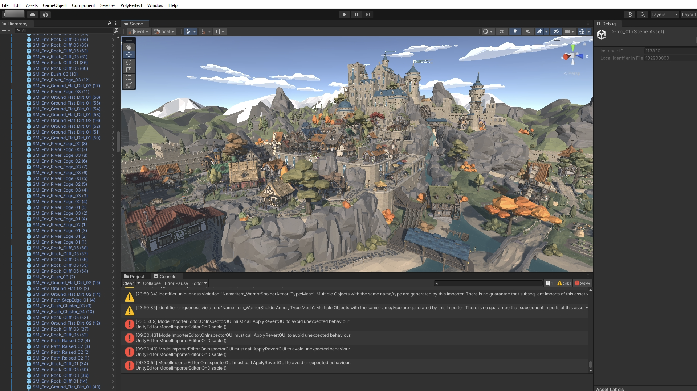
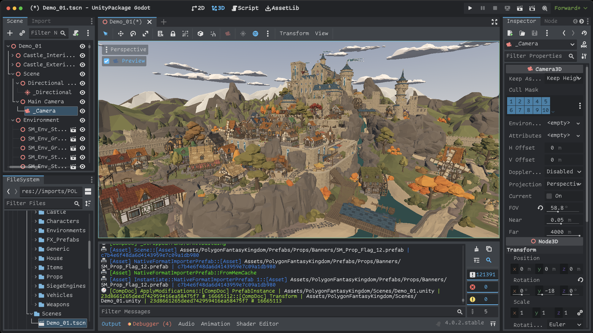

# UnityPackage For Godot

---

---

- Requires [barcoderdev/FBX2glTF](https://github.com/barcoderdev/FBX2glTF) at `res://FBX2glTF` (with .exe on Windows)
  - Download latest version at: https://github.com/barcoderdev/FBX2glTF/actions/ (Login to Github first)
- Requires [barcoderdev/unitypackage_util](https://github.com/barcoderdev/unitypackage_util) at `res://unitypackage_util` (with .exe on Windows)
  - Download latest version at: https://github.com/barcoderdev/unitypackage_util/actions/ (Login to Github first)
- Make sure you can run `./FBX2glTF --help` and `./unitypackage_util --help` from command line, to check permissions
- Config in `res://unitypackage_godot_config.tres`
  - On windows update this with .exe for FBX2glTF.exe and unitypackage_util.exe

## Notes

- This has only been tested with Godot 4.0.3 on macOS 13
  - And Godot 4.0.2 on Windows 10
- Main scene in `res://unitypackage_godot/scenes/main.tscn`
- Uncheck `Immediate Load Assets` in `res://unitypackage_godot_config.tres` to only load what is opened in the UI
- `*.unity` files are converted if they are manually loaded in the UI
- Each node is tagged with a meta named `ufile_ids`, containing a list of `{guid}:{component}` values mapping back to the original Unity component.

## How to use

Initial setup:
- Clone this repo and add compiled unitypackage_util and FBX2glTF to the root of the project
- Check Inspector for `res://unitypackage_godot_config.res`
  - Debug Log:
    - "On" for flashy console logs and debugging
    - "Off" to run a little faster
  - Immediate Load Assets:
    - "On" to build all prefabs/materials when loading packages
    - "Off" to only build assets selected in the file picker
    - `.unity` files must be manually selected to build either way
  - Default Open Path: Optional default location for file open dialog

Import UnityPackage:
- Run the project
- Press `Import UnityPackage` button in upper left
- Select a `.unitypackage` file
- Let it load
- Explore assets in the pack
- Close it or stop running
- Let the freshly imported assets actually import
- Explore the assets that are now in the project itself, default location: `res://imports/`
  - Each UnityPackage generates a folder
  - Each folder contains `catalog.json` as a cached file to load faster next run
  - Each folder contains `location.txt` pointing to where the UnityPackage file is located

Fixing Import Code:
- Adjust the import code
- Clear out what needs to be reimported in `res://imports/`
  - Individual files can be deleted to speed up the process
- Run & import again
- Submit your fixes back to the repo

## How it works

- `OS.execute` is used to call `unitypackage_util`
- `unitypackage_util {PACKAGE} dump` retrieves all the packed file data
- `unitypackage_util {PACKAGE} extract {GUID} --json` is used to extract individual yaml files as json
- `unitypackage_util {PACKAGE} extract {GUID} --fbx2gltf --base64` is used to extract fbx files, converted to glb, in base64 format
- Assets in the UI are tracked by GUID and extracted
- JSON data is walked to rebuild in native format, extracting more files as necessary
- Models, meshes, images, materials, scenes(?? *.unity files), prefabs, are saved to disk as they are loaded/converted
- FBX2glTF was modified to allow stdin/stdout, and to store pivot/transform-origin on each node
- PivotFixer(GLTFDocumentExtension) uses this extra stored data to apply transform origin, later used when building the MeshInstance3D nodes
- Left-to-right hand conversions are handled by -X positions and -X/-W quaternions
- macOS uses pipes to communicate between unitypackage_util and FBX2glTF
  - Windows requires using a temp file for this, temporarily created in the config `Extract Path` folder.

## Shaders

Original shaders are stored in `.txt` files along-side new placeholder shaders.
Uniforms from the original shader are copied into the placeholder so materials maintain their shader properties.
Shader property values are also set as meta data on the materials as backup.

## Currently Implemented

Components:

- GameObject
- MeshFilter
- MeshRenderer
- SkinnedMeshRenderer
- Transform
- Stripped Transform
- Light
- Camera

Importers:

- DefaultImporter
- ModelImporter
- NativeFormatImporter
- PrefabImporter
- TextureImporter
- ShaderImporter (See [Shaders](#shaders) section)
- AudioImporter

## Known Issues

See: https://github.com/barcoderdev/unitypackage_godot/issues
